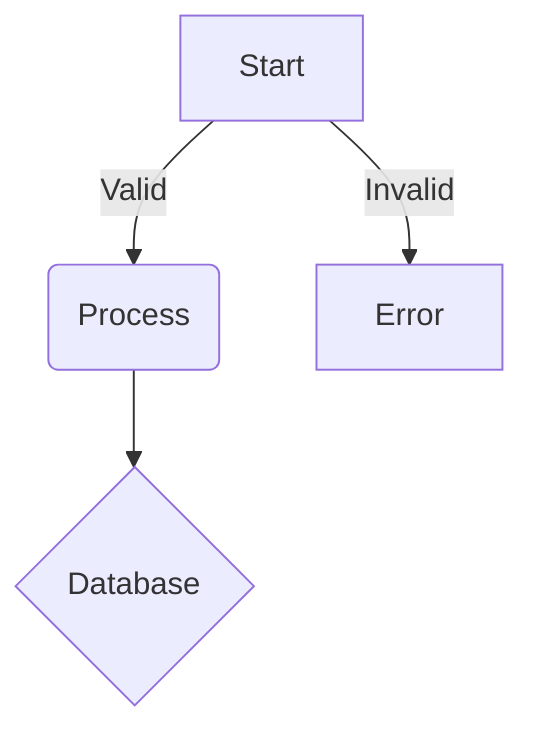
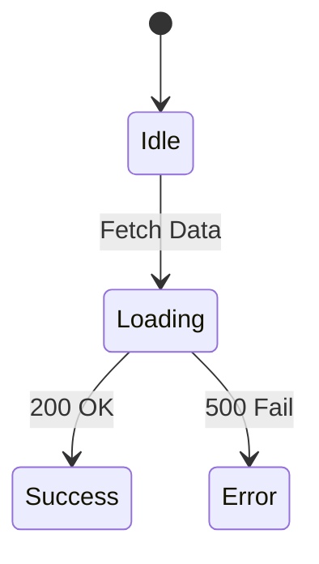
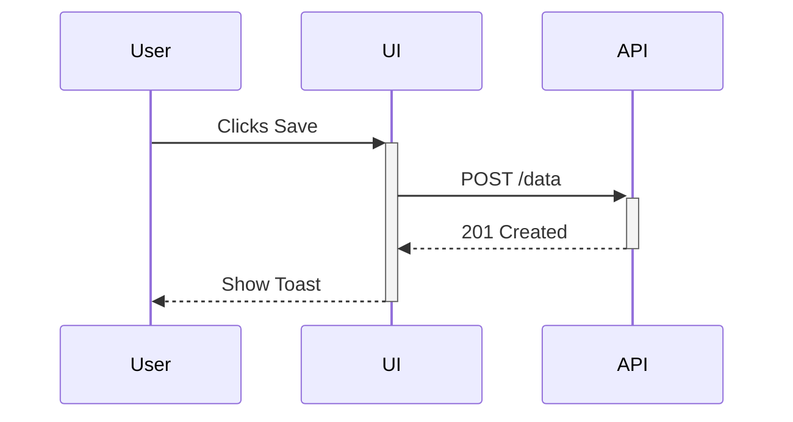
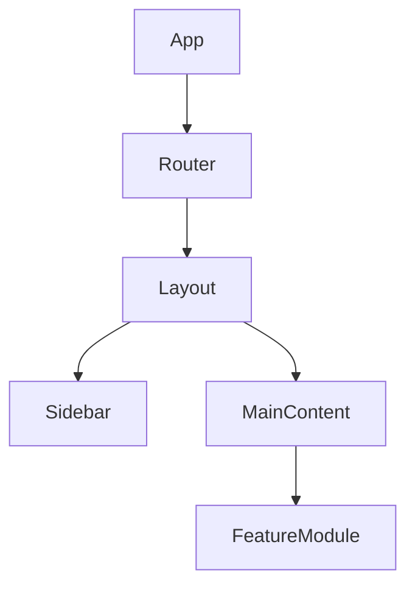

# Visualization Protocol

**RULE:** When explaining abstract concepts, logic flows, or database relationships, YOU MUST generate a Mermaid diagram.

## Supported Types

1. **Flowcharts:** For logic/process (e.g., Auth flow).
2. **Sequence Diagrams:** For API interactions.
3. **ER Diagrams:** For data structures.
4. **State Diagrams:** For UI state machines.

## Syntax Standard

Always wrap mermaid code in a markdown block:

## Examples

### State Machine (UI)

### Data Flow (API)

### Component Hierarchy

> **Related Skills:** [documentation](../documentation/SKILL.md), [architecture-decisions](../architecture-decisions/SKILL.md)
